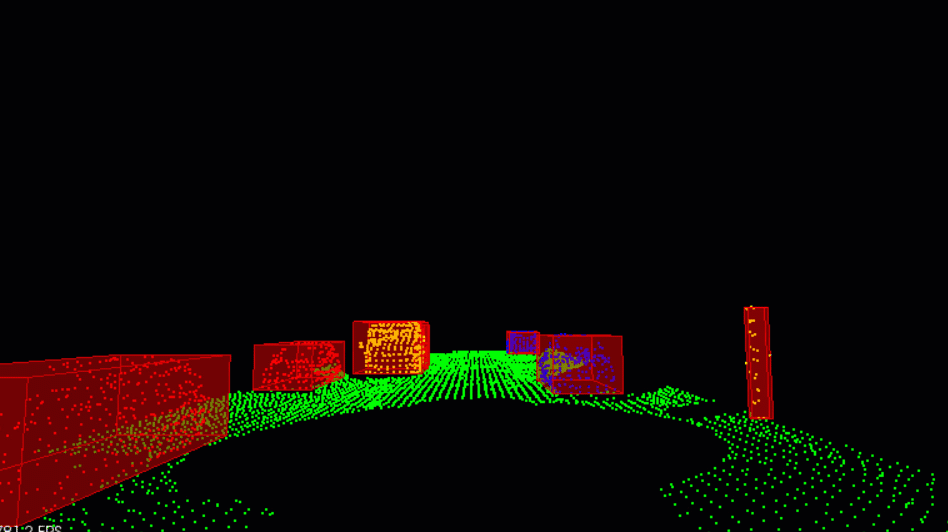

# Project Summary:
This project focuses on generating bounding boxes for objects by processing live point cloud data using the PCL library. The workflow consists of four key steps: downsampling, segmentation, clustering, and bounding box generation. Initially, a Voxel Grid filter is applied to downsample the point cloud within a Region of Interest (ROI). Following this, RANSAC-based plane segmentation is employed to differentiate between road and obstacle points. The obstacle point cloud is then passed to a clustering algorithm that uses a Euclidean distance metric to identify and group individual clusters. Finally, a 3D bounding box is generated for each cluster and visualized using PCL's built-in visualizer.

All code is written in C++.

